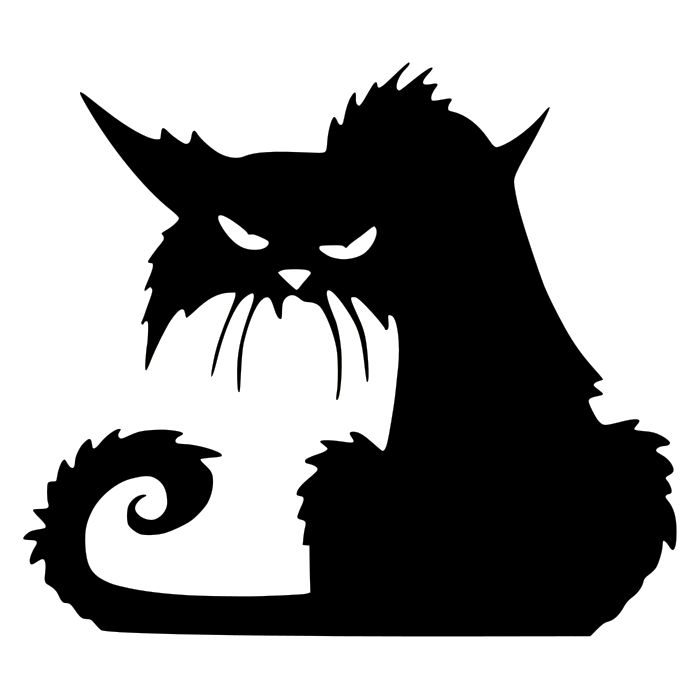

# Angry Cat Design

My personal portfolio

This project is the website that I designed for my personal portfolio and freelance web design company.
<a href="https://jays-t.github.io/resume/">View Live Site</a>

## Table of Contents

  * [**UX - research and goals**](#ux---research-and-goals)
    + [Conclusion of the Research](#conclusion-of-the-research)
    + [Business Goals](#business-goals)
    + [Customer Goals](#customer-goals)
  * [**Features and App Sections**](#features-and-app-sections)
    + [Features](#features)
    + [Features Left to Implement](#features-left-to-implement)
  * [**Graphic Design and Brand Elements**](#graphic-design-and-brand-elements)
    + [Fonts](#fonts)
    + [Colours](#colours)
    + [Icons](#icons)
    + [Images](#images)
    + [Visual Style](#visual-style)
  * [**Technologies Used**](#technologies-used)
  * [**Testing and Defensive Design**](#testing-and-defensive-design)
  * [**Deployment**](#deployment)
    + [Local Deployment](#local-deployment)
  * [**Credits**](#credits)
    + [Content](#content)
    + [Media](#media)
    + [Inspiration Sources](#inspiration-sources)
    + [Coding Sources](#coding-sources)
    + [Acknowledgments](#acknowledgments)

## UX - research and goals

### Conclusion of the Research

### Business Goals

### Customer Goals

    <a href="#table-of-contents"> ⇧ Back To Top </a>

## Features and App Sections

### Web App Sections

### Features

    <a href="#table-of-contents"> ⇧ Back To Top </a>

## Graphic Design and Brand Elements

### Fonts

### Colours

### Icons

### Images

### Visual Style

    <a href="#table-of-contents"> ⇧ Back To Top </a>

## Technologies Used

This project mostly focuses on the following technologies:

1. [HTML](https://en.wikipedia.org/wiki/HTML) - for creating the layout and the structure of the website
1. [CSS](https://en.wikipedia.org/wiki/Cascading_Style_Sheets) - for styling the website’s HTML code
2. [JavaScript](https://en.wikipedia.org/wiki/JavaScript) and [jQuery](https://jquery.com/) - for frontend interactivity
3. [Git](https://git-scm.com/) - for version control

Additionally, I have also used the following platforms to help me shape the website and the brand:

1. [GitHub](https://github.com/) - for hosting the project's repository
2. [TinyPNG](https://tinypng.com/) - for compressing the images so that the website can load faster
3. [Google Fonts](https://fonts.google.com/) - for selecting the fonts
4. [Favicon](https://favicon.io/) - for creating browser tab icons
5. [Autoprefixer](https://autoprefixer.github.io/) - for solving cross-browser CSS issues

    <a href="#table-of-contents"> ⇧ Back To Top </a>

## Testing and Defensive Design

    <a href="#table-of-contents"> ⇧ Back To Top </a>

## Deployment

### Local Deployment

### Sending E-mails through Gmail

    <a href="#table-of-contents"> ⇧ Back To Top </a>

## Credits

### Content

### Media

### Inspiration Sources

### Coding Sources

### Acknowledgments

    <a href="#table-of-contents"> ⇧ Back To Top </a>

